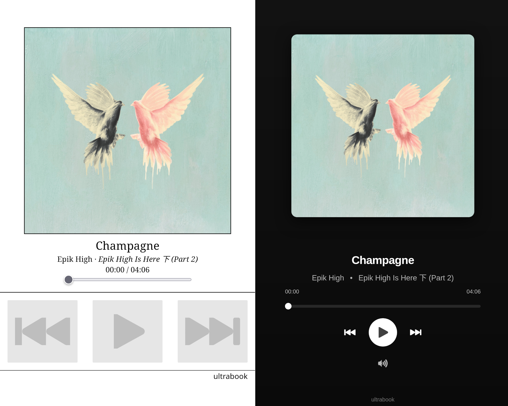

# Rhythmbox Web Remote

Web-based remote control plugin for Rhythmbox.

## Screenshot



## Features

- All the features from original plugin
- New responsive dark UI
- New volume control

## Installation

Run the following commands to install the plugin:

```bash
# Download the plugin
curl -L https://github.com/irfanfadilah/webremote/releases/download/v1.0.0/webremote.zip -o webremote.zip

# Create plugin directory if it doesn't exist
mkdir -p ~/.local/share/rhythmbox/plugins

# Extract to Rhythmbox plugins directory
unzip webremote.zip -d ~/.local/share/rhythmbox/plugins

# Clean up
rm webremote.zip
```

## Setup

1. **Restart Rhythmbox** after installation
2. Open Rhythmbox preferences: `Menu` → `Preferences` → `Plugins`
3. Enable **"Web Remote Control"** plugin
4. Set a passphrase in the plugin settings (optional)
5. Click "Launch web remote control"

## New Volume Control

Click the volume icon to cycle through volume levels:
- **0%** - Muted (no bars)
- **40%** - Low (1 bar)
- **70%** - Medium (2 bars)
- **100%** - High/Full (3 bars)

## Credits

Based on the original [Rhythmbox Web Remote](https://gitlab.gnome.org/GNOME/rhythmbox/-/tree/master/plugins/webremote) plugin.
